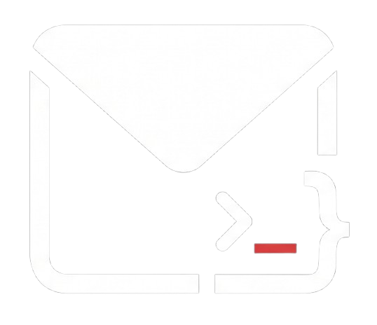

<div align="center">


<br />
# Native Mailer

### A Modern Desktop Email Testing Application

<p align="center">
  
  
  
  
  
</p>

**Native Mailer** is a cross-platform desktop app that runs a local SMTP server for catching and viewing emails during development. Point your app at it and every email it sends lands in a local inbox instead of a real one. Built with Laravel, NativePHP and Filament; no external services needed.

[Features](#-features) • [Installation](#-installation) • [Usage](#-usage) • [Features guide](FEATURES.md)

</div>

---

## ✨ Features

See **[FEATURES.md](FEATURES.md)** for a full guide to every feature and how it works.

### 📬 Capturing mail

-   **Local SMTP server** on `127.0.0.1:1025`, started automatically with the app
-   **Accepts any login**: apps with `MAIL_USERNAME`/`MAIL_PASSWORD` set deliver without changes
-   **Every recipient**: To, CC, and BCC recovered from the SMTP envelope
-   **Decodes real-world mail**: any charset to UTF-8, quoted-printable/base64, encoded subjects and filenames, nested multipart, inline images, calendar invites
-   **Size limit**: messages over 50 MB are refused with `552` (configurable)

### 📥 The inbox

-   **Live updates**: new mail appears the moment it's captured, with a desktop notification
-   **Search** by sender, recipients, subject, **or message body**
-   **Catcher status** under the title: running, port taken by another program, or down (with the reason)
-   **Unread badge** on the app icon (macOS and Linux)
-   **Read/unread** state, filters, bulk actions, and a paperclip for emails with attachments

### 🔍 Reading an email

-   **Tabs** for HTML, HTML source, text, headers, raw source and attachments
-   **Responsive preview** at desktop, tablet (768px) and mobile (375px) widths
-   **Links open in your browser**; the preview never navigates away
-   **Locked-down preview**: sandboxed iframe with a Content-Security-Policy that blocks the email's scripts
-   **HTML checks**: flags development URLs, broken links, missing alt text, Gmail clipping, missing text part, and CSS Outlook ignores

### 🚀 Release and cleanup

-   **Release** a captured email, unchanged, through a real SMTP relay to a real inbox
-   **Retention**: delete emails older than N days and/or keep at most N emails, applied hourly
-   **Delete all** in one click, compacting the database afterwards

---

## 🛠️ Tech Stack

| Technology               | Version | Purpose                    |
| ------------------------ | ------- | -------------------------- |
| **PHP**                  | 8.4+    | Core language (with the `sockets` extension) |
| **Laravel**              | 12.0    | Application framework      |
| **Filament**             | 4.0     | Admin panel framework      |
| **NativePHP Desktop**    | 2.0     | Native application wrapper |
| **Livewire**             | 3.6     | Reactive components        |
| **Tailwind CSS**         | 4.0     | Styling framework          |
| **Vite**                 | 7.0     | Frontend build tool        |
| **SQLite**               | -       | Database                   |

---

## 📋 Requirements

Before you begin, ensure your system meets these requirements:

-   **PHP** 8.4 or higher
-   **Composer** (latest version recommended)
-   **Node.js** 18+ and npm
-   **SQLite** (usually included with PHP)

### Platform-Specific Requirements

#### Windows

-   Windows 10 or later (64-bit)
-   Visual C++ Redistributable (automatically handled by NativePHP)

#### macOS

-   macOS 10.15 (Catalina) or later
-   Xcode Command Line Tools (for building)

#### Linux

-   Modern Linux distribution (Ubuntu 20.04+, Fedora 35+, etc.)
-   GTK 3.0+ libraries

---

## 🚀 Installation

### Quick Setup (Recommended)

```bash
# Clone the repository
git clone https://github.com/1hanif/nativemailer.git
cd nativemailer

# Run the automated setup
composer setup
```

The `composer setup` command will:

1. Install PHP dependencies via Composer
2. Create `.env` file from `.env.example`
3. Generate application key
4. Run database migrations
5. Install Node.js dependencies
6. Build frontend assets

### Manual Setup

If you prefer manual installation:

```bash
# 1. Clone the repository
git clone https://github.com/1hanif/nativemailer.git
cd nativemailer

# 2. Install PHP dependencies
composer install

# 3. Set up environment
cp .env.example .env
php artisan key:generate

# 4. Create and migrate database
touch database/database.sqlite
php artisan migrate

# 5. Install Node dependencies
npm install

# 6. Build assets
npm run build
```

---

## 🎯 Usage

### Running in Development Mode

Start the desktop app with hot-reload for assets:

```bash
composer native:dev
```

This runs `php artisan native:run` and the Vite dev server together.

**What happens when you start the app:**

1. 🚀 NativePHP opens the desktop window
2. 📡 The SMTP catcher starts as a background process on `127.0.0.1:1025`
3. 📬 The inbox opens, ready to receive emails

In development the app uses its own database, `database/nativephp.sqlite`, and doesn't migrate it on start. After pulling changes that add migrations, run:

```bash
php artisan native:migrate
```

Built apps migrate automatically the first time each new version starts.

### Building for Production

Build native executables for distribution:

```bash
# Build for a platform: mac, win or linux
php artisan native:build mac
```

Builds are written to `nativephp/electron/dist/`:

-   **macOS:** `.dmg` and `.zip`
-   **Windows:** `.exe` installer
-   **Linux:** `.AppImage` and `.deb`

Pushing a `v*` tag builds all three platforms on GitHub Actions and attaches them to a GitHub release (see `.github/workflows/release.yml`).

### Configuring Your Application

To send emails from your Laravel application (or any app) to Native Mailer:

#### Laravel Configuration

Update your `.env` file:

```env
MAIL_MAILER=smtp
MAIL_HOST=127.0.0.1
MAIL_PORT=1025
MAIL_FROM_ADDRESS="test@example.com"
MAIL_FROM_NAME="${APP_NAME}"
```

`MAIL_USERNAME` and `MAIL_PASSWORD` can be left as they are: Native Mailer accepts any credentials. If you change the port in the app's Settings, update `MAIL_PORT` to match.

#### Other PHP Applications

```php
// PHPMailer
$mail = new PHPMailer();
$mail->isSMTP();
$mail->Host = '127.0.0.1';
$mail->Port = 1025;
$mail->SMTPAuth = false;

// Symfony Mailer
$transport = Symfony\Component\Mailer\Transport::fromDsn('smtp://127.0.0.1:1025');
$mailer = new Symfony\Component\Mailer\Mailer($transport);
```

#### Testing

Send a test email:

```bash
php artisan tinker
```

```php
Mail::raw('Test email from Native Mailer', function ($message) {
    $message->to('test@example.com')
            ->subject('Test Email');
});
```

Check the Native Mailer app to see your email!

---

## 📁 Project Structure

```
nativemailer/
├── app/
│   ├── Console/Commands/
│   │   └── StartSmtpCatcher.php          # `smtp:start`: runs the catcher
│   ├── Events/
│   │   └── EmailReceived.php             # Broadcast to the UI on capture
│   ├── Filament/Resources/Emails/
│   │   ├── EmailResource.php
│   │   ├── Pages/
│   │   │   ├── ListEmails.php            # Inbox, settings, Delete all, status
│   │   │   └── ViewEmail.php             # Email view, Release, link opening
│   │   ├── Schemas/EmailInfolist.php
│   │   └── Tables/EmailsTable.php        # Inbox columns, search, bulk actions
│   ├── Http/Controllers/
│   │   └── AttachmentController.php      # Serves attachment downloads
│   ├── Models/
│   │   ├── Email.php                     # Retention (pruning), inline images
│   │   ├── EmailAttachment.php
│   │   └── Setting.php                   # Key/value app settings
│   ├── Providers/
│   │   └── NativeAppServiceProvider.php  # Window, catcher process, notifications
│   ├── Services/
│   │   ├── SmtpCatcher.php               # Wires the server to the handler
│   │   ├── Smtp/
│   │   │   ├── SmtpServer.php            # Sockets and the select loop
│   │   │   ├── SmtpSession.php           # SMTP protocol state machine
│   │   │   ├── MimeMessageParser.php     # Raw message → headers, bodies, attachments
│   │   │   └── PersistCapturedEmail.php  # Store, broadcast, notify
│   │   ├── CatcherStatus.php             # Is the catcher up?
│   │   ├── EmailChecks.php               # HTML checks tab
│   │   ├── ReleaseEmail.php              # Forward through a real relay
│   │   └── UnreadBadge.php               # App icon badge
│   └── Support/
│       ├── MimeHeader.php                # RFC 2047 decoding
│       └── PreviewLinks.php              # Preview CSP and link forwarding
├── database/migrations/
├── resources/views/filament/
│   └── email-html-view.blade.php         # The tabbed email viewer
├── routes/
│   ├── web.php                           # Attachment route
│   └── console.php                       # Hourly retention cleanup
└── tests/
    ├── Feature/                          # Pages, storage, retention, integration
    ├── Unit/                             # SMTP session, parser, checks
    └── Fixtures/emails/                  # Real-world .eml messages
```

---

## 🔧 Architecture & Implementation

### SMTP Server Architecture

The catcher runs as a separate NativePHP child process (`php artisan smtp:start`), split into small classes under `app/Services/Smtp`:

```
┌──────────────────────────────────────────────────────────────┐
│                 smtp:start (child process)                   │
│                                                              │
│  ┌──────────────┐    ┌──────────────┐    ┌────────────────┐  │
│  │  SmtpServer  │───▶│ SmtpSession  │───▶│    Persist     │  │
│  │ sockets and  │    │  one per     │    │ CapturedEmail  │  │
│  │ select loop  │    │  client      │    │                │  │
│  └──────────────┘    └──────────────┘    └────────────────┘  │
│                                              │         │     │
│                                              ▼         ▼     │
│                                   ┌──────────────┐ ┌───────┐ │
│                                   │ MimeMessage  │ │  DB,  │ │
│                                   │ Parser       │ │ event,│ │
│                                   └──────────────┘ │ badge │ │
│                                                    └───────┘ │
└──────────────────────────────────────────────────────────────┘
```

**Key Features:**

-   **Non-blocking I/O**: one `socket_select` loop handles many connections, with an idle timeout
-   **State machine**: HELO/EHLO, AUTH, MAIL, RCPT and DATA states, with dot-stuffing and size limits
-   **Fail-safe**: a malformed email is logged to `storage/logs/smtp.log` and never stops the server

### Email Processing Flow

```
Email Sent ──▶ SMTP Server ──▶ Parse Headers ──▶ Extract Content
                   │                                    │
                   ▼                                    ▼
              Store Raw Data ──────────────▶ Save to Database
                                                       │
                                                       ▼
                                              Trigger Event ──▶ UI Update
```

### Database Schema

**`emails`**

| Column        | Type      | Description                                   |
| ------------- | --------- | --------------------------------------------- |
| `id`          | bigint    | Primary key                                   |
| `from`        | string    | Sender address                                |
| `to`          | string    | To addresses                                  |
| `cc`          | text      | CC addresses                                  |
| `bcc`         | text      | Envelope recipients not listed in To or CC    |
| `subject`     | string    | Decoded subject line                          |
| `body_text`   | longtext  | Plain-text part (UTF-8)                       |
| `body_html`   | longtext  | HTML part (UTF-8)                             |
| `raw`         | longtext  | The complete message as received              |
| `is_read`     | boolean   | Read state                                    |
| `received_at` | timestamp | When it was captured (indexed)                |

**`email_attachments`**: one row per attachment (`name`, `content_type`, `size`, `content_id`, `inline`, and the file bytes in `content`), deleted along with its email.

**`settings`**: key/value store for the port, retention and release relay settings.

---

## 🎨 Features in Detail

The full guide is in **[FEATURES.md](FEATURES.md)**. A few highlights:

### Email Preview System

HTML emails are rendered in a sandboxed iframe with an opaque origin:

```blade
<iframe srcdoc="{{ $email->previewHtml() }}" sandbox="allow-scripts"></iframe>
```

-   The iframe can't access the app: there's no `allow-same-origin`
-   A Content-Security-Policy injected into the email only allows Native Mailer's own link handler (by nonce). The email's scripts, event handlers and `javascript:` links are blocked
-   Clicked links are passed to the app and opened in your default browser
-   Remote images and styles load as they would in a real mail client

### SMTP Protocol Implementation

| Command       | Description                                   | Example                            |
| ------------- | --------------------------------------------- | ---------------------------------- |
| `HELO`/`EHLO` | Start a session (EHLO lists extensions)       | `EHLO client.example.com`          |
| `AUTH`        | `PLAIN` or `LOGIN`; any credentials accepted  | `AUTH PLAIN AHVzZXIAc2VjcmV0`      |
| `MAIL FROM`   | Sender, with optional `SIZE=`                 | `MAIL FROM:<sender@example.com>`   |
| `RCPT TO`     | A recipient (repeat for each)                 | `RCPT TO:<recipient@example.com>`  |
| `DATA`        | The message, ending with a line of `.`        | `DATA`                             |
| `RSET`        | Abort the current message                     | `RSET`                             |
| `NOOP`        | Do nothing                                    | `NOOP`                             |
| `QUIT`        | Close the connection                          | `QUIT`                             |

EHLO advertises `SIZE`, `AUTH PLAIN LOGIN`, `8BITMIME` and `SMTPUTF8`.

---

## 🔍 Development

### Running Tests

```bash
# Run all tests
php artisan test

# Run one file or test
php artisan test --filter=MimeMessageParserTest
```

The suite includes:

-   **Unit tests** for the SMTP session, the MIME parser and the HTML checks
-   **Fixture tests** against real `.eml` messages in `tests/Fixtures/emails/`
-   **An integration test** that starts the real `smtp:start` on a free port and sends mail to it over TCP (needs the `sockets` extension)

GitHub Actions runs the tests and a Pint style check on every pull request (`.github/workflows/tests.yml`).

### Code Quality

Format code using Laravel Pint:

```bash
# Fix code style
./vendor/bin/pint

# Preview changes without fixing
./vendor/bin/pint --test
```

### Development Workflow

```bash
# Runs the desktop app and the Vite dev server together
composer native:dev
```

### Manual SMTP Testing

Test the SMTP server directly using telnet:

```bash
telnet 127.0.0.1 1025
```

```
EHLO localhost
MAIL FROM:<test@example.com>
RCPT TO:<recipient@example.com>
DATA
Subject: Test Email
From: test@example.com
To: recipient@example.com

This is a test email body.
.
QUIT
```

### Debugging

Logs are stored in:

-   `storage/logs/laravel.log`: application logs, including catcher start-up errors
-   `storage/logs/smtp.log`: emails that failed to parse or store, with the start of the raw message

The php.ini settings for the desktop app are in `NativeAppServiceProvider::phpIni()`. `display_errors` is off so errors never render in the app window; they go to the logs.

---

## 🚧 Troubleshooting

### Port Already in Use

The status line under the inbox title tells you when another program holds the port. Either pick a different port in **Settings** (and update `MAIL_PORT` in your apps), or free the port:

```bash
# Windows - find the process using port 1025
netstat -ano | findstr :1025
taskkill /F /PID <PID>

# macOS/Linux
lsof -ti:1025 | xargs kill -9
```

### Database Issues

The desktop app in development uses `database/nativephp.sqlite`. To start over (this deletes all captured emails):

```bash
php artisan native:migrate:fresh
```

### Build Issues

Clear caches and rebuild:

```bash
php artisan config:clear
php artisan cache:clear
php artisan view:clear
npm run build
```

---

## 🤝 Contributing

Contributions are welcome and appreciated! Here's how you can help:

### Reporting Bugs

1. Check if the issue already exists
2. Include detailed reproduction steps
3. Provide system information (OS, PHP version, etc.)
4. Include relevant logs or screenshots

### Suggesting Features

1. Describe the feature and its benefits
2. Provide use cases
3. Consider implementation complexity

### Pull Requests

1. **Fork** the repository
2. **Create** a feature branch
    ```bash
    git checkout -b feature/amazing-feature
    ```
3. **Commit** your changes
    ```bash
    git commit -m 'Add amazing feature'
    ```
4. **Push** to your branch
    ```bash
    git push origin feature/amazing-feature
    ```
5. **Open** a Pull Request

### Development Guidelines

-   Follow PSR-12 coding standards
-   Write tests for new features
-   Update documentation as needed
-   Run `./vendor/bin/pint` before committing
-   Keep commits atomic and well-described

---

## 📝 License

This project is open-source software licensed under the [MIT License](LICENSE).

```
MIT License

Copyright (c) 2025 Mustapha Hanif

Permission is hereby granted, free of charge, to any person obtaining a copy
of this software and associated documentation files (the "Software"), to deal
in the Software without restriction, including without limitation the rights
to use, copy, modify, merge, publish, distribute, sublicense, and/or sell
copies of the Software, and to permit persons to whom the Software is
furnished to do so, subject to the following conditions:

The above copyright notice and this permission notice shall be included in all
copies or substantial portions of the Software.
```

---

## 🙏 Acknowledgments

This project is built on the shoulders of giants:

-   **[Laravel](https://laravel.com)** - The PHP framework for web artisans
-   **[NativePHP](https://nativephp.com)** - Build native desktop applications with PHP
-   **[Filament](https://filamentphp.com)** - Beautiful admin panels for Laravel
-   **[Livewire](https://livewire.laravel.com)** - Full-stack framework for Laravel
-   **[Tailwind CSS](https://tailwindcss.com)** - Utility-first CSS framework
-   **[Vite](https://vitejs.dev)** - Next generation frontend tooling

Special thanks to:

-   The Laravel community for their amazing packages and support
-   The NativePHP team for making native PHP apps possible
-   All contributors and users of Native Mailer

---

## 👨‍💻 Author

**Mustapha Hanif**

-   GitHub: [@projecthanif](https://github.com/projecthanif)
-   Email: [Contact via GitHub](https://github.com/projecthanif)

---

## 🌟 Show Your Support

If you find this project helpful, please consider:

-   ⭐ Starring the repository
-   🐛 Reporting bugs
-   💡 Suggesting new features
-   🔀 Contributing code
-   📢 Sharing with others

---

## 📊 Project Stats


---

<div align="center">

**Made with ❤️ using Laravel and NativePHP**

[⬆ Back to Top](#-native-mailer)

</div>
